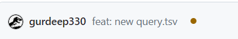

[](https://github.com/VirtualPatientEngine/literatureSurvey/actions/workflows/tests.yml)
[](https://github.com/VirtualPatientEngine/literatureSurvey/actions/workflows/release.yml)
[](https://github.com/VirtualPatientEngine/literatureSurvey/actions/workflows/mkdocs-deploy.yml)
[](https://github.com/VirtualPatientEngine/literatureSurvey/actions/workflows/pages/pages-build-deployment)

<h1 align="center" style="border-bottom: none;">🔍 An automated literature survey tool</h1>

Welcome to [Team VPE](https://github.com/VirtualPatientEngine)'s Literature Survey Template Repository! 📚✨ This repository:
1. Describes a quick setup to create your very own automated literature survey website using Semantic Scholar's [Recommendation API](https://api.semanticscholar.org/api-docs/recommendations).
2. Offers an option to import the recommended articles to your [Zotero](https://www.zotero.org/) account.
3. Runs itself automatically every Monday morning to fetch a new list of recommended articles.

To know more about what Team VPE does, checkout our [GitHub page](https://github.com/VirtualPatientEngine), or even better, follow us by clicking the `Follow` button on our [GitHub page](https://github.com/VirtualPatientEngine)! 😊

If you find our literature survey tool helpful and enjoy using it, we'd really appreciate it if you could give our repository a ⭐️! Your support helps us continue to improve and grow. Thank you! 😊

### Table of Contents 📋
1. [Recommendation types](#-recommendation-types)
2. [Usage](#-usage)
3. [Getting Started for Non Developers](#-getting-started-for-non-developers)
4. [Getting Started for Developers](#-getting-started-for-developers)
5. [Bugs or Feature Requests](#-bugs-or-feature-requests)

### 💡 Recommendation types
Semantic Scholar provides 2 types of recommendations:

1. ```Single-paper recommendations```: Each article you provide will be used to generate AI-based recommendations specifically for that article.
2. ```Category-based recommendations```: Every category of articles you provide will used to generate AI-based recommendations specifically for that list. If you choose to define more than one category, our tool will treat all articles within a specific category as positives, and all remaining articles from other categories as negatives. Our tool will next use these articles to generate recommendations for the articles within that category. This method is particularly useful if you are interested in dividing a broad topic into different categories and want our tool to fine-tune and generate recommendations for each category.

### 🚀 Usage
For demonstration purposes, this template repository uses articles related to time-series simulations as an example. You can easily customize it to your own fields of interest by following the steps outlined below. To see how the automated literature survey repo looks like, visit this [link](https://virtualpatientengine.github.io/literatureSurvey).

Let's dive in and set up your own literature survey adventure!

### 🎨 Getting Started for Non Developers
_Jump to the next section if you are a developer_
1. Prepare a ```query.tsv``` file with 3 columns:
    - Under the `Title` column, give titles to your topics. It is mandatory to define at least one topic.
    - Under the `Use` column, write <kbd>1</kbd> if you want to use the article for recommendations or <kbd>0</kbd> if you just want to display the article on the website without using it to generate recommendations.
    - Under the `URL` column, specify the corresponding URLs to [Semantic Scholar](https://www.semanticscholar.org/) articles. Only one line per artticle. You may assign more than articles to a topic.

2. Navigate to the data folder in the repository by clicking ```app > data``` on the GitHub page.


3. Click on the dropdown `Add file` followed by ```Upload files``` buttons.


4. Upload the ```query.tsv``` file that you have prepared. Under the header ```Commit changes```, in the first field (_Add files via upload_), type ***feat: new query.tsv***, and press the blue-colored ```Commit changes``` button at the bottom of the page.

5. This will trigger a workflow to update the literature survey, and can take a few minutes. You should be able to see a brown-colored circle on your main GitHub page. This means that the workflow is still running. Once that goes away, your website is up and running.
.

6. To view your website, click on the gear button (top-right) and a menu to edit your repository details will open up. Check the `Use your GitHub Pages website` checkbox to make your website appear in the `Website` field above. This the URL to your website. Bookmark the website or come back to your website's GitHub page in case you forget the URL.


If you find our literature survey tool helpful and enjoy using it, we'd really appreciate it if you could give our repository a ⭐️! Your support helps us continue to improve and grow. Thank you! 😊


### 🧑‍💻 Getting Started for Developers
Follow these simple steps (_requires the knowledge of at least python_) to set up your literature survey website:

1. Click on the ```Use this template``` button to create your own repository based on this template, and clone it on your system.

2. Navigate and open up the ```app/data/query.tsv``` file in your favorite code editor or Excel.

3. Set up the file as described below:
    - Under the `Title` column, give titles to your topics. It is mandatory to define at least one topic.
    - Under the `Use` column, write <kbd>1</kbd> if you want to use the article for recommendations or <kbd>0</kbd> if you just want to display the article on the website without using it to generate recommendations.
    - Under the `URL` column, specify the corresponding URLs to [Semantic Scholar](https://www.semanticscholar.org/) articles. Only one line per artticle. You may assign more than articles to a topic.

    _❗ Please note that if you are familiar with [git](https://git-scm.com/), you may also choose to commit the query.tsv file using git commands from your local machine. Remember to prepare the commit message as described below._

4. Create a virtual environment:
```
> python -m venv env
# On Windows
> .\env\Scripts\activate

# On macOS and Linux
> source env/bin/activate
```

5. Install all the necessary requirements:
```
> pip3 install -r requirements.txt
```

6. It's time to fetch some literature! Run the ```literature_fetch_recommendation_api.py``` script to grab the recommended articles from Semantic Scholar:
```
> cd app/code
> python3 literature_fetch_recommendation_api.py
```

7. Now, fire up MkDocs locally to view the recommended articles:
```
> mkdocs serve
```
Head over to the localhost link that pops up in your terminal. 

8. This repository includes a `mkdocs-deploy.yml` [workflow](https://github.com/VirtualPatientEngine/literatureSurvey/blob/main/.github/workflows/mkdocs-deploy.yml) that uses GitHub Actions to automatically execute the specified script **once a week** and deploy the literature survey system as a [GitHub Pages website](https://virtualpatientengine.github.io/literatureSurvey/). Feel free to edit to based on your project needs or use it as it is.

> To host your literature survey system online, you must place the YML file in the `.github/workflows/` folder. Once you have pushed you code to GitHub, under the [Actions](https://github.com/VirtualPatientEngine/literatureSurvey/actions) tab, you'll find the ongoing `mkdocs-deploy.yml` workflow (this might take up to 1h depending on the current workload of compute servers and length of the publication list). Once this workflow finishes, head over to the [Settings/Pages](https://github.com/VirtualPatientEngine/literatureSurvey/settings/pages) tab. From there, choose `Deploy from a branch` in the Source section. Under the Branch subsection, select `gh-pages` and root from the dropdown menus, then click `Save`.

9. Under `About` section of your repository, head to the gear symbol and check the box `Use your GitHub Pages website` and `Save changes`. You will see an URL to your literature survey repository under `About` section of the `Code` tab. 

10. Change <kbd>site_url</kbd>, <kbd>theme:/logo:</kbd>, <kbd>repo_url</kbd>, and <kbd>repo_name</kbd> in ```base.yml``` to the values related to your project.

11. If you'd like to edit the home page of the website, head over to `docs/index.md` to make the changes.

12. (Optional) Edit custom.css if you'd like to change the styling of web pages.

13. Commit your code:
```
> git add .
> git commit -m 'feat: update list of articles'
> git push origin main
```

14. This will trigger a workflow to update the literature survey, and can take a few minutes. You should be able to see a brown-colored circle on your main GitHub page. This means that the workflow is still running. Once that goes away, your website is up and running.

.

15. To view your website, click on the gear button (top-right) and a menu to edit your repository details will open up. Check the `Use your GitHub Pages website` checkbox to make your website appear in the `Website` field above. This the URL to your website. Bookmark the website or come back to your website's GitHub page in case you forget the URL.

If you find our literature survey tool helpful and enjoy using it, we'd really appreciate it if you could give our repository a ⭐️! Your support helps us continue to improve and grow. Thank you! 😊


### 🔖 Zotero Plugin
If you'd like to read the recommended articles in your own [Zotero](https://www.zotero.org/) Account:
1. Create an account with Zotero
2. Under the `Settings` tab in your GitHub repo, click on `Secrets and variables`, and select `Actions`
3. Set the following `Repository secrets`:
    - `ZOTERO_API_KEY` as Zotero API key (you can get it [here](https://www.zotero.org/settings/keys/new))
    - `LIBRARY_ID` as your group ID (this can be found by opening the group's page: https://www.zotero.org/groups/groupname , and hovering over the group settings link. The ID is the integer after /groups/)
    - `TEST_COLLECTION_KEY` as your collection's key (enter `https://api.zotero.org/groups/<LIBRARY_ID>/collections?key=<ZOTERO_API_KEY>` in your browser to view all the collections in your group; choose the key of the collection in which you'd like the recommended articles to be sotred)
4. The changes take effect only when the code is re-run. This can happen either the next time the code is scheduled for a run (Mondays) or under the `Actions` tab, select `mkdocs-deploy` from the left panel, and click on `Run workflow`.

_❗ Please note that this tool will keep pushing new recommendations on a weekly basis to your Zotero account. You may have to clear out/empty the collection every week to avoid surplus of articles._

### 🐞 Bugs or Feature Requests
If you encounter any bugs or have brilliant ideas for new features, please head over to the [Issues](https://github.com/VirtualPatientEngine/literatureSurvey/issues) and let us know.

### 📖 Happy surveying!
