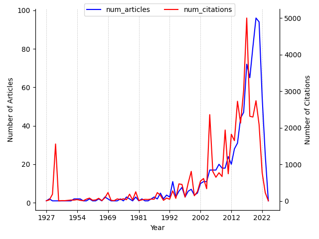

---
hide:
 - navigation
---

### 1. Search query

*(koopman\*) | (transformations in hilbert space) | (linear transformation of PDEs) | (regularization of physics-informed machine learning)*

### 2. Koopman Theory articles and citations over time

### 3. Most cited articles on Koopman Theory

| Title | PublicationDate | #Citations | Journal/Conference | publicationVenue |
| --- | --- | --- | --- | --- |
| [Hamiltonian Systems and Transformation in Hilbert Space.](https://www.semanticscholar.org/paper/bf657b5049c1a5c839369d3948ffb4c0584cd1d2) | 1931-05-01 | 1558 | {'name': 'Proceedings of the National Academy of Sciences of the United States of America', 'pages': '\n 315-8\n ', 'volume': '17 5'} | {'id': 'bb95bf2e-8383-4748-bf9d-d6906d091085', 'name': 'Proceedings of the National Academy of Sciences of the United States of America', 'type': 'journal', 'alternate\_names': ['PNAS', 'PNAS online', 'Proceedings of the National Academy of Sciences of the United States of America.', 'Proc National Acad Sci', 'Proceedings of the National Academy of Sciences', 'Proc National Acad Sci u s Am'], 'issn': '0027-8424', 'alternate\_issns': ['1091-6490'], 'url': 'https://www.jstor.org/journal/procnatiacadscie', 'alternate\_urls': ['http://www.pnas.org/', 'https://www.pnas.org/', 'http://www.jstor.org/journals/00278424.html', 'www.pnas.org/']} |
| [A Data–Driven Approximation of the Koopman Operator: Extending Dynamic Mode Decomposition](https://www.semanticscholar.org/paper/10cab2f43c29fe12e5a0d0718eb6e1ff8c9d4777) | 2014-08-19 | 1323 | {'name': 'Journal of Nonlinear Science', 'pages': '1307 - 1346', 'volume': '25'} | {'id': '619f4cc3-1d00-4060-b88d-9854843ac2c2', 'name': 'Journal of nonlinear science', 'type': 'journal', 'alternate\_names': ['J Nonlinear Sci', 'Journal of Nonlinear Science', 'J nonlinear sci'], 'issn': '0938-8974', 'url': 'https://link.springer.com/journal/332'} |
| [Deep learning for universal linear embeddings of nonlinear dynamics](https://www.semanticscholar.org/paper/6adeda1af8abc6bc3c17c0b39f635a845476cd9f) | 2017-12-27 | 899 | {'name': 'Nature Communications', 'volume': '9'} | {'id': '43b3f0f9-489a-4566-8164-02fafde3cd98', 'name': 'Nature Communications', 'type': 'journal', 'alternate\_names': ['Nat Commun'], 'issn': '2041-1723', 'url': 'https://www.nature.com/ncomms/', 'alternate\_urls': ['http://www.nature.com/ncomms/about/index.html', 'http://www.nature.com/ncomms/index.html']} |
| [Entanglement renormalization.](https://www.semanticscholar.org/paper/7e54d86fb36907b99ef0580bfaea9b43c5942ae7) | 2005-12-08 | 784 | {'name': 'Physical review letters', 'pages': '\n 220405\n ', 'volume': '99 22'} | {'id': '16c9f9d4-bee1-435d-8c85-22a3deba109d', 'name': 'Physical Review Letters', 'type': 'journal', 'alternate\_names': ['Phys Rev Lett'], 'issn': '0031-9007', 'url': 'https://journals.aps.org/prl/', 'alternate\_urls': ['http://journals.aps.org/prl/', 'http://prl.aps.org/']} |
| [Applied Koopmanism.](https://www.semanticscholar.org/paper/2c9be1e38f978f43427ea5293b3138e0c4fede71) | 2012-06-14 | 694 | {'name': 'Chaos', 'pages': '\n 047510\n ', 'volume': '22 4'} | {'id': '30c0ded7-c8b4-473c-bbc0-f237234ac1a6', 'name': 'Chaos', 'type': 'journal', 'issn': '1054-1500', 'url': 'http://chaos.aip.org/', 'alternate\_urls': ['https://aip.scitation.org/journal/cha']} |
| [CT Imaging of the 2019 Novel Coronavirus (2019-nCoV) Pneumonia](https://www.semanticscholar.org/paper/b90161898ff5ef4236f1c19a5c88138e1c80c5ea) | 2020-01-31 | 658 | {'name': 'Radiology'} | {'id': '357207a3-a4af-4091-822c-75ef52d02fb5', 'name': 'Radiology', 'type': 'journal', 'issn': '0033-8419', 'url': 'http://radiology.rsna.org/', 'alternate\_urls': ['http://radiology.rsnajnls.org/']} |
| [Variants of Dynamic Mode Decomposition: Boundary Condition, Koopman, and Fourier Analyses](https://www.semanticscholar.org/paper/82e19123c7fdf1c047531eec5bce6f925dcc5ad5) | 2012-04-27 | 642 | {'name': 'Journal of Nonlinear Science', 'pages': '887-915', 'volume': '22'} | {'id': '619f4cc3-1d00-4060-b88d-9854843ac2c2', 'name': 'Journal of nonlinear science', 'type': 'journal', 'alternate\_names': ['J Nonlinear Sci', 'Journal of Nonlinear Science', 'J nonlinear sci'], 'issn': '0938-8974', 'url': 'https://link.springer.com/journal/332'} |
| [Linear predictors for nonlinear dynamical systems: Koopman operator meets model predictive control](https://www.semanticscholar.org/paper/dbb73c3f14600e3a746c643c2e8bece117de6be4) | 2016-11-10 | 635 | {'name': 'Autom.', 'pages': '149-160', 'volume': '93'} | None |
| [Algorithms for the Split Variational Inequality Problem](https://www.semanticscholar.org/paper/ff73ad9e51f79cc364545e7933f22cc2a74f28fc) | 2010-09-20 | 594 | {'name': 'Numerical Algorithms', 'pages': '301 - 323', 'volume': '59'} | {'id': '3920fb0a-e610-4b5d-8760-f43cfa321466', 'name': 'Numerical Algorithms', 'type': 'journal', 'alternate\_names': ['Numer Algorithm'], 'issn': '1017-1398', 'url': 'https://www.springer.com/computer/theoretical+computer+science/journal/11075?changeHeader', 'alternate\_urls': ['https://link.springer.com/journal/11075']} |
| [Quantum singular value transformation and beyond: exponential improvements for quantum matrix arithmetics](https://www.semanticscholar.org/paper/fa00b2c3d2fe8326470c47a3e5f5d1e716e58cb3) | 2018-06-05 | 472 | {'name': 'Proceedings of the 51st Annual ACM SIGACT Symposium on Theory of Computing'} | {'id': '8113a511-e0d9-4231-a1bc-0bf5d0212a4e', 'name': 'Symposium on the Theory of Computing', 'type': 'conference', 'alternate\_names': ['Symp Theory Comput', 'STOC'], 'url': 'http://acm-stoc.org/'} |

### 4. Latest articles on Koopman Theory

| Title | PublicationDate | #Citations | Journal/Conference | publicationVenue |
| --- | --- | --- | --- | --- |
| [A Data-Driven Koopman Approach for Power System Nonlinear Dynamic Observability Analysis](https://www.semanticscholar.org/paper/cf4e03fdbc78190194b74a5e1ad20465c5dd6463) | 2024-03-01 | 0 | {'name': 'IEEE Transactions on Power Systems', 'pages': '4090-4104', 'volume': '39'} | {'id': 'dbbda9ef-0504-4875-b893-5c964f6b8f0e', 'name': 'IEEE Transactions on Power Systems', 'type': 'journal', 'alternate\_names': ['IEEE Trans Power Syst'], 'issn': '0885-8950', 'url': 'http://ieeexplore.ieee.org/servlet/opac?punumber=59'} |
| [A Monte Carlo Approach to Koopman Direct Encoding and Its Application to the Learning of Neural-Network Observables](https://www.semanticscholar.org/paper/cabacb5b65447bbb8ef5f0f82c37cd1a66cf2282) | 2024-03-01 | 0 | {'name': 'IEEE Robotics and Automation Letters', 'pages': '2264-2271', 'volume': '9'} | {'id': '93c335b7-edf4-45f5-8ddc-7c5835154945', 'name': 'IEEE Robotics and Automation Letters', 'alternate\_names': ['IEEE Robot Autom Lett'], 'issn': '2377-3766', 'url': 'https://www.ieee.org/membership-catalog/productdetail/showProductDetailPage.html?product=PER481-ELE', 'alternate\_urls': ['http://ieeexplore.ieee.org/servlet/opac?punumber=7083369']} |
| [Improving potential energy surfaces using measured Feshbach resonance states](https://www.semanticscholar.org/paper/b5f96d19a20f448255c0e361b01caf9aeff87938) | 2024-03-01 | 0 | {'name': 'Science Advances', 'volume': '10'} | {'id': 'cb30f0c9-2980-4b7d-bbcb-68fc5472b97c', 'name': 'Science Advances', 'type': 'journal', 'alternate\_names': ['Sci Adv'], 'issn': '2375-2548', 'url': 'http://www.scienceadvances.org/', 'alternate\_urls': ['https://advances.sciencemag.org/']} |
| [Robust Three-Stage Dynamic Mode Decomposition for Analysis of Power System Oscillations](https://www.semanticscholar.org/paper/1a279d90354755f741f45618a5673e220a715fc7) | 2024-03-01 | 0 | {'name': 'IEEE Transactions on Power Systems', 'pages': '4000-4009', 'volume': '39'} | {'id': 'dbbda9ef-0504-4875-b893-5c964f6b8f0e', 'name': 'IEEE Transactions on Power Systems', 'type': 'journal', 'alternate\_names': ['IEEE Trans Power Syst'], 'issn': '0885-8950', 'url': 'http://ieeexplore.ieee.org/servlet/opac?punumber=59'} |
| [Data-Driven Transient Stability Evaluation of Electric Distribution Networks Dominated by EV Supercharging Stations](https://www.semanticscholar.org/paper/15757b898cf9ba88030c73486a039b5b296a118b) | 2024-03-01 | 0 | {'name': 'IEEE Transactions on Smart Grid', 'pages': '1939-1950', 'volume': '15'} | {'id': '1c2f3998-b5ca-48ca-9991-94b71c71ecb7', 'name': 'IEEE Transactions on Smart Grid', 'type': 'journal', 'alternate\_names': ['IEEE Trans Smart Grid'], 'issn': '1949-3053', 'url': 'http://ieeexplore.ieee.org/servlet/opac?punumber=5165411'} |
| [Approximation of discrete and orbital Koopman operators over subsets and manifolds](https://www.semanticscholar.org/paper/1d4ea3a7943c108bee09f107e42ffdf0fd3cfde3) | 2024-02-22 | 0 | {'name': 'Nonlinear Dynamics'} | {'id': '10925c1c-0929-4ec5-8268-a8a52bd84631', 'name': 'Nonlinear dynamics', 'type': 'journal', 'alternate\_names': ['Nonlinear Dyn', 'Nonlinear Dynamics', 'Nonlinear dyn'], 'issn': '0924-090X', 'url': 'http://www.springer.com/11071', 'alternate\_urls': ['https://link.springer.com/journal/11071']} |
| [Learning Hamiltonian neural Koopman operator and simultaneously sustaining and discovering conservation laws](https://www.semanticscholar.org/paper/8fc588323ba32123f635b9c7f7c1568a3f09ab38) | 2024-02-20 | 0 | {'name': 'Physical Review Research'} | {'id': '349f119f-f4ee-48cf-aedb-89bcb56ab8e3', 'name': 'Physical Review Research', 'type': 'journal', 'alternate\_names': ['Phys Rev Res'], 'issn': '2643-1564', 'url': 'https://journals.aps.org/prresearch'} |
| [Extraction of nonlinearity in neural networks and model compression with Koopman operator](https://www.semanticscholar.org/paper/f090e77e916fba1a8f28cd4c46a65b0f2c9ae494) | 2024-02-18 | 0 | {'name': 'ArXiv', 'volume': 'abs/2402.11740'} | {'id': '1901e811-ee72-4b20-8f7e-de08cd395a10', 'name': 'arXiv.org', 'alternate\_names': ['ArXiv'], 'issn': '2331-8422', 'url': 'https://arxiv.org'} |
| [Machine Learning based Prediction of Ditching Loads](https://www.semanticscholar.org/paper/cb1cf69a67974f03796db6657e21635ea6832285) | 2024-02-16 | 0 | {'name': 'ArXiv', 'volume': 'abs/2402.10724'} | {'id': '1901e811-ee72-4b20-8f7e-de08cd395a10', 'name': 'arXiv.org', 'alternate\_names': ['ArXiv'], 'issn': '2331-8422', 'url': 'https://arxiv.org'} |
| [Kolmogorov n-Widths for Multitask Physics-Informed Machine Learning (PIML) Methods: Towards Robust Metrics](https://www.semanticscholar.org/paper/4e9fbef5c8daddbad96e50c3e1da8614d7772a75) | 2024-02-16 | 0 | {'name': 'ArXiv', 'volume': 'abs/2402.11126'} | {'id': '1901e811-ee72-4b20-8f7e-de08cd395a10', 'name': 'arXiv.org', 'alternate\_names': ['ArXiv'], 'issn': '2331-8422', 'url': 'https://arxiv.org'} |

