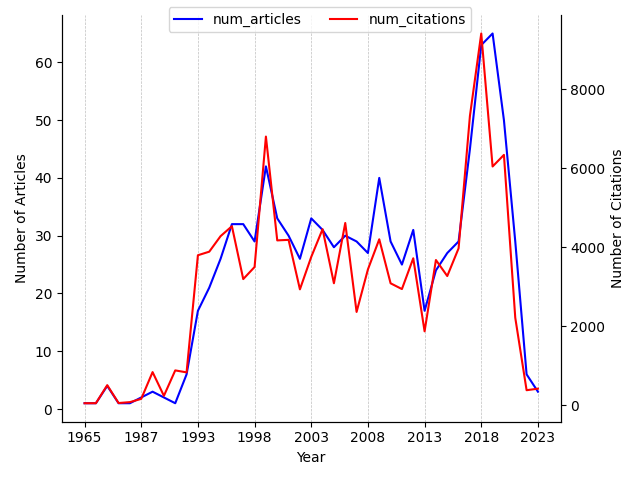

---
hide:
 - navigation
---

### 1. Search query

*(VAMP) | (latent space simul\*) | (decomposition of koopman operator) | (time-lagged autoencoder)*

### 2. Latent Space Simulator articles and citations over time

### 3. Most cited articles on Latent Space Simulator

| Title | PublicationDate | #Citations | Journal/Conference | publicationVenue |
| --- | --- | --- | --- | --- |
| [Denoising Diffusion Implicit Models](https://www.semanticscholar.org/paper/014576b866078524286802b1d0e18628520aa886) | 2020-10-06 | 2512 | {'name': 'ArXiv', 'volume': 'abs/2010.02502'} | {'id': '939c6e1d-0d17-4d6e-8a82-66d960df0e40', 'name': 'International Conference on Learning Representations', 'type': 'conference', 'alternate\_names': ['Int Conf Learn Represent', 'ICLR'], 'url': 'https://iclr.cc/'} |
| [GTM: The Generative Topographic Mapping](https://www.semanticscholar.org/paper/2639515c248f220c73d44688c0097a99b01e1474) | None | 1496 | {'name': 'Neural Computation', 'pages': '215-234', 'volume': '10'} | {'id': '69b9bcdd-8229-4a00-a6e0-00f0e99a2bf3', 'name': 'Neural Computation', 'type': 'journal', 'alternate\_names': ['Neural Comput'], 'issn': '0899-7667', 'url': 'http://cognet.mit.edu/library/journals/journal?issn=08997667', 'alternate\_urls': ['http://ieeexplore.ieee.org/servlet/opac?punumber=6720226', 'http://www.mitpressjournals.org/loi/neco', 'https://www.mitpressjournals.org/loi/neco']} |
| [A Data–Driven Approximation of the Koopman Operator: Extending Dynamic Mode Decomposition](https://www.semanticscholar.org/paper/10cab2f43c29fe12e5a0d0718eb6e1ff8c9d4777) | 2014-08-19 | 1323 | {'name': 'Journal of Nonlinear Science', 'pages': '1307 - 1346', 'volume': '25'} | {'id': '619f4cc3-1d00-4060-b88d-9854843ac2c2', 'name': 'Journal of nonlinear science', 'type': 'journal', 'alternate\_names': ['J Nonlinear Sci', 'Journal of Nonlinear Science', 'J nonlinear sci'], 'issn': '0938-8974', 'url': 'https://link.springer.com/journal/332'} |
| [Deep Autoencoding Gaussian Mixture Model for Unsupervised Anomaly Detection](https://www.semanticscholar.org/paper/dbc7401e3e75c40d3c720e7db3c906d48bd742d7) | 2018-02-15 | 1236 | {'name': '', 'volume': ''} | {'id': '939c6e1d-0d17-4d6e-8a82-66d960df0e40', 'name': 'International Conference on Learning Representations', 'type': 'conference', 'alternate\_names': ['Int Conf Learn Represent', 'ICLR'], 'url': 'https://iclr.cc/'} |
| [Botulinum neurotoxin A selectively cleaves the synaptic protein SNAP-25](https://www.semanticscholar.org/paper/8af762911107a585f12decd890c4bc5df67dc3fb) | 1993-09-09 | 1165 | {'name': 'Nature', 'pages': '160-163', 'volume': '365'} | {'id': '6c24a0a0-b07d-4d7b-a19b-fd09a3ed453a', 'name': 'Nature', 'type': 'journal', 'issn': '0028-0836', 'url': 'https://www.nature.com/', 'alternate\_urls': ['http://www.nature.com/nature/', 'https://www.nature.com/nature/', 'http://www.nature.com/nature/archive/index.html']} |
| [Poincaré Embeddings for Learning Hierarchical Representations](https://www.semanticscholar.org/paper/1590bd1bca945fc6ff50b8cdf2da14ea2061c79a) | 2017-05-22 | 1031 | {'name': 'ArXiv', 'volume': 'abs/1705.08039'} | {'id': 'd9720b90-d60b-48bc-9df8-87a30b9a60dd', 'name': 'Neural Information Processing Systems', 'type': 'conference', 'alternate\_names': ['Neural Inf Process Syst', 'NeurIPS', 'NIPS'], 'url': 'http://neurips.cc/'} |
| [Validation of information recorded on general practitioner based computerised data resource in the United Kingdom.](https://www.semanticscholar.org/paper/66a626038ce5c68c0b28a1d6b74a3a135338a11e) | 1991-03-30 | 877 | {'name': 'British Medical Journal', 'pages': '766 - 768', 'volume': '302'} | {'id': '3048b449-a773-4256-9bb5-5e61fbb61e52', 'name': 'British medical journal', 'type': 'journal', 'alternate\_names': ['BMJ (Clinical Research Edition)', 'British Medical Journal', 'Br Med J', 'BMJ (british Med J', 'The BMJ (British Medical Journal)', 'eBMJ', 'Br med j', 'BMJ (clinical Res Ed', 'Br Med J (clinical Res Ed', 'British Medical Journal (Clinical Research Edition)', 'BMJ'], 'issn': '1759-2151', 'alternate\_issns': ['1756-1833', '0959-8138', '1790-5249', '1106-5028', '1468-5833', '0267-0623', '1222-5835', '1576-9445', '1106-4226'], 'url': 'https://www.bmj.com/', 'alternate\_urls': ['http://www.ibmj.net/', 'https://www.jstor.org/journal/bmjbritmedj', 'http://www.jstor.org/journals/09598138.html', 'http://www.bmj.ro/', 'http://www.bmj.com/bmj/', 'http://www.bmj.com/thebmj', 'http://www.jstor.org/action/showPublication?journalCode=bmjbritmedj', 'http://www.jstor.org/action/showPublication?journalCode=britmedjclires', 'https://www.bmj.com/archive']} |
| [Cross-domain sentiment classification via spectral feature alignment](https://www.semanticscholar.org/paper/ca781a2fc31a28f653b222ca8afdedc90a009266) | 2010-04-26 | 792 | {'pages': '751-760'} | {'id': 'e07422f9-c065-40c3-a37b-75e98dce79fe', 'name': 'The Web Conference', 'type': 'conference', 'alternate\_names': ['Web Conf', 'WWW'], 'url': 'http://www.iw3c2.org/'} |
| [Synaptic vesicle membrane fusion complex: action of clostridial neurotoxins on assembly.](https://www.semanticscholar.org/paper/d0baba24df9807ea8fa812f477fc8cd57adfe116) | 1994-11-01 | 783 | {'name': 'The EMBO Journal', 'volume': '13'} | {'id': 'b89f0ede-6fa8-4dd2-a8a7-f54695a00323', 'name': 'EMBO Journal', 'type': 'journal', 'alternate\_names': ['The EMBO Journal', 'EMBO J'], 'issn': '0261-4189', 'url': 'http://embojournal.npgjournals.com/', 'alternate\_urls': ['http://emboj.embopress.org/']} |
| [VBF: Vector-Based Forwarding Protocol for Underwater Sensor Networks](https://www.semanticscholar.org/paper/631755c88361cdf537bbe1eff8bdf18c52d6c962) | 2006-05-15 | 732 | {'pages': '1216-1221'} | None |

### 4. Latest articles on Latent Space Simulator

| Title | PublicationDate | #Citations | Journal/Conference | publicationVenue |
| --- | --- | --- | --- | --- |
| [Topic Modeling on Document Networks With Dirichlet Optimal Transport Barycenter](https://www.semanticscholar.org/paper/f8db237dfcbac885f750f86939ce006268519cca) | 2024-03-01 | 0 | {'name': 'IEEE Transactions on Knowledge and Data Engineering', 'pages': '1328-1340', 'volume': '36'} | {'id': 'c6840156-ee10-4d78-8832-7f8909811576', 'name': 'IEEE Transactions on Knowledge and Data Engineering', 'type': 'journal', 'alternate\_names': ['IEEE Trans Knowl Data Eng'], 'issn': '1041-4347', 'url': 'https://www.computer.org/web/tkde', 'alternate\_urls': ['http://ieeexplore.ieee.org/servlet/opac?punumber=69']} |
| [Multiclass and Multilabel Classifications by Consensus and Complementarity-Based Multiview Latent Space Projection](https://www.semanticscholar.org/paper/bee3c8b32859202472c917dab5a4757afb46a79f) | 2024-03-01 | 0 | {'name': 'IEEE Transactions on Systems, Man, and Cybernetics: Systems', 'pages': '1705-1718', 'volume': '54'} | None |
| [Learning-Based Edge-Device Collaborative DNN Inference in IoVT Networks](https://www.semanticscholar.org/paper/81cabd91414b487f021c110ba9c70311ad6636e9) | 2024-03-01 | 0 | {'name': 'IEEE Internet of Things Journal', 'pages': '7989-8004', 'volume': '11'} | {'id': '228761ec-c40a-479b-8309-9dcbe9851bcd', 'name': 'IEEE Internet of Things Journal', 'type': 'journal', 'alternate\_names': ['IEEE Internet Thing J'], 'issn': '2327-4662', 'url': 'https://www.ieee.org/membership-catalog/productdetail/showProductDetailPage.html?product=PER288-ELE', 'alternate\_urls': ['https://ieeexplore.ieee.org/servlet/opac?punumber=6488907', 'https://ieeexplore.ieee.org/xpl/RecentIssue.jsp?punumber=6488907', 'http://ieee-iotj.org/#']} |
| [NeuralFloors: Conditional Street-Level Scene Generation From BEV Semantic Maps via Neural Fields](https://www.semanticscholar.org/paper/28c0ff11f5a18b051f591807d531429636fa8037) | 2024-03-01 | 0 | {'name': 'IEEE Robotics and Automation Letters', 'pages': '2431-2438', 'volume': '9'} | {'id': '93c335b7-edf4-45f5-8ddc-7c5835154945', 'name': 'IEEE Robotics and Automation Letters', 'alternate\_names': ['IEEE Robot Autom Lett'], 'issn': '2377-3766', 'url': 'https://www.ieee.org/membership-catalog/productdetail/showProductDetailPage.html?product=PER481-ELE', 'alternate\_urls': ['http://ieeexplore.ieee.org/servlet/opac?punumber=7083369']} |
| [Robust Three-Stage Dynamic Mode Decomposition for Analysis of Power System Oscillations](https://www.semanticscholar.org/paper/1a279d90354755f741f45618a5673e220a715fc7) | 2024-03-01 | 0 | {'name': 'IEEE Transactions on Power Systems', 'pages': '4000-4009', 'volume': '39'} | {'id': 'dbbda9ef-0504-4875-b893-5c964f6b8f0e', 'name': 'IEEE Transactions on Power Systems', 'type': 'journal', 'alternate\_names': ['IEEE Trans Power Syst'], 'issn': '0885-8950', 'url': 'http://ieeexplore.ieee.org/servlet/opac?punumber=59'} |
| [Vibration-based structural damage localization through a discriminant analysis strategy with cepstral coefficients](https://www.semanticscholar.org/paper/ad7af3dfb3aa9bf417a98e84fb3bab61f46fc04f) | 2024-02-28 | 0 | {'name': 'Structural Health Monitoring'} | {'id': '928c5b4b-9a67-473f-996e-bf7e28c1e736', 'name': 'Structural Health Monitoring', 'type': 'journal', 'alternate\_names': ['Struct Health Monit', 'Struct Health Monit Int J', 'Structural Health Monitoring-an International Journal'], 'issn': '1475-9217', 'url': 'https://journals.sagepub.com/home/shm', 'alternate\_urls': ['http://shm.sagepub.com/']} |
| [Spectral Time-Varying Pattern Causality and Its Application.](https://www.semanticscholar.org/paper/8129bbd354a9694aa23224775d4b612e427aa529) | 2024-02-28 | 0 | {'name': 'IEEE journal of biomedical and health informatics', 'volume': 'PP'} | {'id': 'eac74c9c-a5c0-417d-8088-8164a6a8bfb3', 'name': 'IEEE journal of biomedical and health informatics', 'type': 'journal', 'alternate\_names': ['IEEE Journal of Biomedical and Health Informatics', 'IEEE j biomed health informatics', 'IEEE J Biomed Health Informatics'], 'issn': '2168-2194', 'url': 'https://ieeexplore.ieee.org/xpl/aboutJournal.jsp?punumber=6221020', 'alternate\_urls': ['https://ieeexplore.ieee.org/xpl/RecentIssue.jsp?punumber=6221020']} |
| [Big topic modeling based on a two-level hierarchical latent Beta-Liouville allocation for large-scale data and parameter streaming](https://www.semanticscholar.org/paper/714a07ff77f81ded2fd359c97468890d12a3dad2) | 2024-02-28 | 0 | {'name': 'Pattern Analysis and Applications', 'pages': '1-21', 'volume': '27'} | {'id': '69d98769-bd34-4c40-a508-895b6adfac86', 'name': 'Pattern Analysis and Applications', 'type': 'journal', 'alternate\_names': ['Pattern Anal Appl'], 'issn': '1433-7541', 'url': 'https://rd.springer.com/journal/10044'} |
| [Sensor based Dance Coherent Action Generation Model using Deep Learning Framework](https://www.semanticscholar.org/paper/78b968af546e846d26bd851a619c438a70c6ce68) | 2024-02-24 | 0 | {'name': 'Scalable Computing: Practice and Experience'} | None |
| [Monstrous Mushrooms, Toxic Love and Queer Utopias in Jenny Hval's Paradise Rot](https://www.semanticscholar.org/paper/cb8bbf850e7e0eef682ed7d42e23606bfce01cdc) | 2024-02-21 | 0 | {'name': 'Junctions: Graduate Journal of the Humanities'} | {'id': 'ad439cd7-5bd3-4d03-a3e4-17167ef8fb89', 'name': 'Junctions: Graduate Journal of the Humanities', 'type': 'journal', 'alternate\_names': ['Junction Grad J Humanit'], 'issn': '2468-8282', 'url': 'https://junctionsjournal.org/'} |

