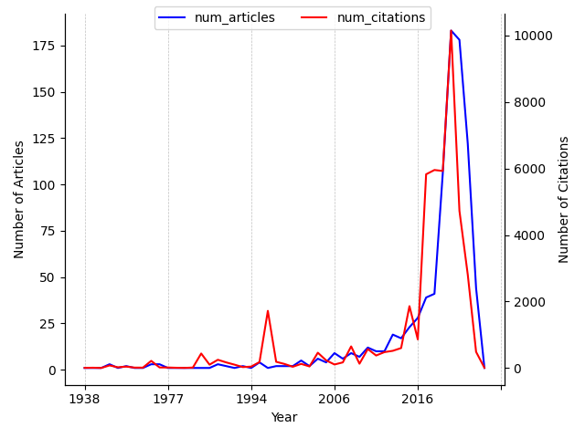

---
hide:
 - navigation
---

### 1. Search query

*(neural ordinary differential equation) | (neural ODE) | (graph neural differential equation) | (graph neural diffusion) | (graph neural ODEs)*

### 2. Neural ODEs articles and citations over time

### 3. Most cited articles on Neural ODEs

| Title | PublicationDate | #Citations | Journal/Conference | publicationVenue |
| --- | --- | --- | --- | --- |
| [Neural Ordinary Differential Equations](https://www.semanticscholar.org/paper/449310e3538b08b43227d660227dfd2875c3c3c1) | 2018-06-19 | 3515 | {'pages': '6572-6583'} | {'id': 'd9720b90-d60b-48bc-9df8-87a30b9a60dd', 'name': 'Neural Information Processing Systems', 'type': 'conference', 'alternate\_names': ['Neural Inf Process Syst', 'NeurIPS', 'NIPS'], 'url': 'http://neurips.cc/'} |
| [Score-Based Generative Modeling through Stochastic Differential Equations](https://www.semanticscholar.org/paper/633e2fbfc0b21e959a244100937c5853afca4853) | 2020-11-26 | 2596 | {'name': 'ArXiv', 'volume': 'abs/2011.13456'} | {'id': '939c6e1d-0d17-4d6e-8a82-66d960df0e40', 'name': 'International Conference on Learning Representations', 'type': 'conference', 'alternate\_names': ['Int Conf Learn Represent', 'ICLR'], 'url': 'https://iclr.cc/'} |
| [Diffusion Convolutional Recurrent Neural Network: Data-Driven Traffic Forecasting](https://www.semanticscholar.org/paper/9ba0186ed40656329c421f55ada7313293e13f17) | 2017-07-06 | 2119 | {'name': 'arXiv: Learning', 'volume': ''} | {'id': '939c6e1d-0d17-4d6e-8a82-66d960df0e40', 'name': 'International Conference on Learning Representations', 'type': 'conference', 'alternate\_names': ['Int Conf Learn Represent', 'ICLR'], 'url': 'https://iclr.cc/'} |
| [Artificial neural networks for solving ordinary and partial differential equations](https://www.semanticscholar.org/paper/5ebbe0b1a3d7a2431bbb25d6dfeec7ed6954d633) | 1997-05-19 | 1720 | {'name': 'IEEE transactions on neural networks', 'pages': '\n 987-1000\n ', 'volume': '9 5'} | None |
| [Diffusion-Convolutional Neural Networks](https://www.semanticscholar.org/paper/18b47b83a373f33d6b902a3615f42c10f7600d72) | 2015-11-06 | 1082 | {'pages': '1993-2001'} | {'id': 'd9720b90-d60b-48bc-9df8-87a30b9a60dd', 'name': 'Neural Information Processing Systems', 'type': 'conference', 'alternate\_names': ['Neural Inf Process Syst', 'NeurIPS', 'NIPS'], 'url': 'http://neurips.cc/'} |
| [Dynamic Edge-Conditioned Filters in Convolutional Neural Networks on Graphs](https://www.semanticscholar.org/paper/1a39bb2caa151d15efd6718f3a80d9f4bff95af2) | 2017-04-10 | 1071 | {'name': '2017 IEEE Conference on Computer Vision and Pattern Recognition (CVPR)', 'pages': '29-38'} | {'id': '768b87bb-8a18-4d9c-a161-4d483c776bcf', 'name': 'Computer Vision and Pattern Recognition', 'type': 'conference', 'alternate\_names': ['CVPR', 'Comput Vis Pattern Recognit'], 'issn': '1063-6919', 'url': 'https://ieeexplore.ieee.org/xpl/conhome.jsp?punumber=1000147', 'alternate\_urls': ['https://en.wikipedia.org/wiki/Conference\_on\_Computer\_Vision\_and\_Pattern\_Recognition']} |
| [FFJORD: Free-form Continuous Dynamics for Scalable Reversible Generative Models](https://www.semanticscholar.org/paper/8afa6dd9f9ac46462a1fb70a757c4ae1cd45bbf6) | 2018-09-27 | 688 | {'name': 'ArXiv', 'volume': 'abs/1810.01367'} | {'id': '939c6e1d-0d17-4d6e-8a82-66d960df0e40', 'name': 'International Conference on Learning Representations', 'type': 'conference', 'alternate\_names': ['Int Conf Learn Represent', 'ICLR'], 'url': 'https://iclr.cc/'} |
| [Stable architectures for deep neural networks](https://www.semanticscholar.org/paper/37be889f4654312109dc9c53395fe117adb0f72b) | 2017-05-09 | 591 | {'name': 'Inverse Problems', 'volume': '34'} | {'id': '1901e811-ee72-4b20-8f7e-de08cd395a10', 'name': 'arXiv.org', 'alternate\_names': ['ArXiv'], 'issn': '2331-8422', 'url': 'https://arxiv.org'} |
| [Brian: A Simulator for Spiking Neural Networks in Python](https://www.semanticscholar.org/paper/aac882f968b720785613673508e7783f0efd7182) | 2008-07-11 | 526 | {'name': 'Frontiers in Neuroinformatics', 'volume': '2'} | {'id': '8eabe4e5-3d91-4297-ab8f-475904598d30', 'name': 'BMC Neuroscience', 'type': 'journal', 'alternate\_names': ['BMC Neurosci'], 'issn': '1471-2202', 'url': 'http://www.biomedcentral.com/bmcneurosci/', 'alternate\_urls': ['https://bmcneurosci.biomedcentral.com/', 'http://www.pubmedcentral.nih.gov/tocrender.fcgi?journal=49', 'http://www.biomedcentral.com/bmcneurosci/archive/']} |
| [DPM-Solver: A Fast ODE Solver for Diffusion Probabilistic Model Sampling in Around 10 Steps](https://www.semanticscholar.org/paper/4530c25da949bb2185c50663158ef19d52e3c6b5) | 2022-06-02 | 495 | {'name': 'ArXiv', 'volume': 'abs/2206.00927'} | {'id': 'd9720b90-d60b-48bc-9df8-87a30b9a60dd', 'name': 'Neural Information Processing Systems', 'type': 'conference', 'alternate\_names': ['Neural Inf Process Syst', 'NeurIPS', 'NIPS'], 'url': 'http://neurips.cc/'} |

### 4. Latest articles on Neural ODEs

| Title | PublicationDate | #Citations | Journal/Conference | publicationVenue |
| --- | --- | --- | --- | --- |
| [Continuous Image Outpainting with Neural ODE](https://www.semanticscholar.org/paper/2566d035a3d7f12df59b7053a610fbd54161562b) | 2024-03-02 | 0 | {'name': 'SSRN Electronic Journal'} | {'id': '75d7a8c1-d871-42db-a8e4-7cf5146fdb62', 'name': 'Social Science Research Network', 'type': 'journal', 'alternate\_names': ['SSRN, Social Science Research Network (SSRN) home page', 'SSRN Electronic Journal', 'Soc Sci Res Netw', 'SSRN', 'SSRN Home Page', 'SSRN Electron J', 'Social Science Electronic Publishing presents Social Science Research Network'], 'issn': '1556-5068', 'url': 'http://www.ssrn.com/', 'alternate\_urls': ['www.ssrn.com/', 'https://fatcat.wiki/container/tol7woxlqjeg5bmzadeg6qrg3e', 'https://www.wikidata.org/wiki/Q53949192', 'www.ssrn.com/en', 'http://www.ssrn.com/en/', 'http://umlib.nl/ssrn', 'umlib.nl/ssrn']} |
| [Graph Convolutional Neural Networks for Automated Echocardiography View Recognition: A Holistic Approach](https://www.semanticscholar.org/paper/3779b87d10925ca2bf96c3b8b971330c8682e06e) | 2024-02-29 | 0 | {'pages': '44-54'} | None |
| [Modelling and Distribution of Electricity Load Forecasting in Nigeria Power System (Olu-Ode Community)](https://www.semanticscholar.org/paper/77308f9484b9c372ad028e04301c07f5e92c566b) | 2024-02-28 | 0 | {'name': 'International Journal of Advanced Engineering and Nano Technology'} | {'id': 'b2a6f6aa-b866-4069-8e96-b765cd7776f9', 'name': 'International Journal of Advanced Engineering and Nano Technology', 'type': 'journal', 'alternate\_names': ['Int J Adv Eng Nano Technol'], 'issn': '2347-6389', 'url': 'https://www.ijaent.org/'} |
| [Changes in Structural Neural Networks in the Recovery Process of Motor Paralysis after Stroke](https://www.semanticscholar.org/paper/93a3bdec5c232a639d5cd0be5f7cb430caafdd2f) | 2024-02-21 | 0 | {'name': 'Brain Sciences'} | {'id': '39058e09-c13a-4545-a8a3-a75581460bc2', 'name': 'Brain Science', 'type': 'journal', 'alternate\_names': ['Brain Sciences', 'Brain Sci'], 'issn': '2570-0197', 'alternate\_issns': ['2076-3425'], 'url': 'http://www.e-helvetica.nb.admin.ch/directAccess?callnumber=bel-217894', 'alternate\_urls': ['https://www.mdpi.com/journal/brainsci', 'https://epub.uni-regensburg.de/37319/', 'http://nbn-resolving.de/urn/resolver.pl?urn=urn:nbn:ch:bel-217894']} |
| [Zhang neural networks: an introduction to predictive computations for discretized time-varying matrix problems](https://www.semanticscholar.org/paper/d9b9e3efbe9528468442ca216a59223847d31fa4) | 2024-02-19 | 0 | {'name': 'Numerische Mathematik'} | {'id': '23ed2049-ad4e-4e12-8e48-a4e55bc4e377', 'name': 'Numerische Mathematik', 'type': 'journal', 'alternate\_names': ['Numer Math'], 'issn': '0029-599X', 'url': 'http://www.springer.com/mathematics/numerical+and+computational+mathematics/journal/211', 'alternate\_urls': ['http://www.digizeitschriften.de/main/dms/toc/?PPN=PPN362160546', 'https://link.springer.com/journal/211']} |
| [Emulating the interstellar medium chemistry with neural operators](https://www.semanticscholar.org/paper/5005529d4850a80e2234177e2a2625ed7ac60a68) | 2024-02-19 | 0 | {'name': 'Astronomy & Astrophysics'} | None |
| [Temporal Disentangled Contrastive Diffusion Model for Spatiotemporal Imputation](https://www.semanticscholar.org/paper/94e459909290d427dffaee3052a19ed32300b89a) | 2024-02-18 | 0 | {'name': 'ArXiv', 'volume': 'abs/2402.11558'} | {'id': '1901e811-ee72-4b20-8f7e-de08cd395a10', 'name': 'arXiv.org', 'alternate\_names': ['ArXiv'], 'issn': '2331-8422', 'url': 'https://arxiv.org'} |
| [Uncertainty Quantification of Graph Convolution Neural Network Models of Evolving Processes](https://www.semanticscholar.org/paper/3e64d1ecf181a7115d7f4a61834f1e7e7defc6bf) | 2024-02-17 | 0 | {'name': 'ArXiv', 'volume': 'abs/2402.11179'} | {'id': '1901e811-ee72-4b20-8f7e-de08cd395a10', 'name': 'arXiv.org', 'alternate\_names': ['ArXiv'], 'issn': '2331-8422', 'url': 'https://arxiv.org'} |
| [ContiFormer: Continuous-Time Transformer for Irregular Time Series Modeling](https://www.semanticscholar.org/paper/5ee2008c1eab4545f1e001b2cf3c0578b7a1aafe) | 2024-02-16 | 1 | {'name': 'ArXiv', 'volume': 'abs/2402.10635'} | {'id': 'd9720b90-d60b-48bc-9df8-87a30b9a60dd', 'name': 'Neural Information Processing Systems', 'type': 'conference', 'alternate\_names': ['Neural Inf Process Syst', 'NeurIPS', 'NIPS'], 'url': 'http://neurips.cc/'} |
| [Beyond Kalman Filters: Deep Learning-Based Filters for Improved Object Tracking](https://www.semanticscholar.org/paper/dfb10dec07e4e45faec83014d0c6764bd5a0a588) | 2024-02-15 | 0 | {'name': 'ArXiv', 'volume': 'abs/2402.09865'} | {'id': '1901e811-ee72-4b20-8f7e-de08cd395a10', 'name': 'arXiv.org', 'alternate\_names': ['ArXiv'], 'issn': '2331-8422', 'url': 'https://arxiv.org'} |

