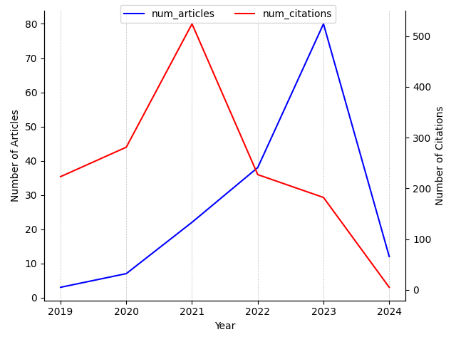

---
hide:
 - navigation
---

### 1. Search query

*(physics-informed neural computing)*

### 2. PINNs articles and citations over time

### 3. Most cited articles on PINNs

| Title | PublicationDate | #Citations | Journal/Conference | publicationVenue |
| --- | --- | --- | --- | --- |
| [Physics-informed learning of governing equations from scarce data](https://www.semanticscholar.org/paper/e596988b1df3a0bc78bf72c0bfdb21c85eaab6c9) | 2020-05-05 | 177 | {'name': 'Nature Communications', 'volume': '12'} | {'id': '43b3f0f9-489a-4566-8164-02fafde3cd98', 'name': 'Nature Communications', 'type': 'journal', 'alternate\_names': ['Nat Commun'], 'issn': '2041-1723', 'url': 'https://www.nature.com/ncomms/', 'alternate\_urls': ['http://www.nature.com/ncomms/about/index.html', 'http://www.nature.com/ncomms/index.html']} |
| [Learning in Modal Space: Solving Time-Dependent Stochastic PDEs Using Physics-Informed Neural Networks](https://www.semanticscholar.org/paper/7fdccf0d550e1a8db830d280bbf3e7b3e6d66653) | 2019-05-03 | 160 | {'name': 'ArXiv', 'volume': 'abs/1905.01205'} | {'id': '0e3b51a7-21d8-477c-8918-14a55f087532', 'name': 'SIAM Journal on Scientific Computing', 'type': 'journal', 'alternate\_names': ['SIAM J Sci Comput'], 'issn': '1064-8275', 'url': 'http://www.siam.org/journals/sisc.php', 'alternate\_urls': ['https://epubs.siam.org/journal/sjoce3']} |
| [Efficient training of physics‐informed neural networks via importance sampling](https://www.semanticscholar.org/paper/af68d37e2721abe702bacfcea5111f9ec59012ce) | 2021-04-26 | 113 | {'name': 'Computer‐Aided Civil and Infrastructure Engineering', 'pages': '962 - 977', 'volume': '36'} | None |
| [The Old and the New: Can Physics-Informed Deep-Learning Replace Traditional Linear Solvers?](https://www.semanticscholar.org/paper/1a0db1672f4d08a81b02fd35453d5d04d3013635) | 2021-03-12 | 109 | {'name': 'Frontiers in Big Data', 'volume': '4'} | {'id': '165fa1b5-e07f-4b6e-9203-04493f6a7c5c', 'name': 'Frontiers in Big Data', 'alternate\_names': ['Front Big Data'], 'issn': '2624-909X', 'url': 'https://www.frontiersin.org/journals/big-data'} |
| [ClimaX: A foundation model for weather and climate](https://www.semanticscholar.org/paper/874deb5f06f35e52ae13a921b23611eec4abd1da) | 2023-01-24 | 87 | {'pages': '25904-25938'} | {'id': 'fc0a208c-acb7-47dc-a0d4-af8190e21d29', 'name': 'International Conference on Machine Learning', 'type': 'conference', 'alternate\_names': ['ICML', 'Int Conf Mach Learn'], 'url': 'https://icml.cc/'} |
| [A Physics-Informed Neural Network for Quantifying the Microstructural Properties of Polycrystalline Nickel Using Ultrasound Data: A promising approach for solving inverse problems](https://www.semanticscholar.org/paper/bde6492eb852a10ffd4bba5d7df23e37f9b81a3e) | 2021-03-25 | 52 | {'name': 'IEEE Signal Processing Magazine', 'pages': '68-77', 'volume': '39'} | {'id': 'f62e5eab-173a-4e0a-a963-ed8de9835d22', 'name': 'IEEE Signal Processing Magazine', 'type': 'journal', 'alternate\_names': ['IEEE Signal Process Mag'], 'issn': '1053-5888', 'url': 'http://ieeexplore.ieee.org/servlet/opac?punumber=79', 'alternate\_urls': ['https://ieeexplore.ieee.org/xpl/RecentIssue.jsp?punumber=79']} |
| [NeuralPDE: Automating Physics-Informed Neural Networks (PINNs) with Error Approximations](https://www.semanticscholar.org/paper/e15133cfd09c2a2eb98c38468a897866a904d125) | 2021-07-19 | 44 | {'name': 'ArXiv', 'volume': 'abs/2107.09443'} | {'id': '1901e811-ee72-4b20-8f7e-de08cd395a10', 'name': 'arXiv.org', 'alternate\_names': ['ArXiv'], 'issn': '2331-8422', 'url': 'https://arxiv.org'} |
| [A comparative study of physics-informed neural network models for learning unknown dynamics and constitutive relations](https://www.semanticscholar.org/paper/373a6cb7cf455191a81cd16649e0a02ecb558e7a) | 2019-04-02 | 33 | {'name': 'ArXiv', 'volume': 'abs/1904.04058'} | {'id': '1901e811-ee72-4b20-8f7e-de08cd395a10', 'name': 'arXiv.org', 'alternate\_names': ['ArXiv'], 'issn': '2331-8422', 'url': 'https://arxiv.org'} |
| [A novel meta-learning initialization method for physics-informed neural networks](https://www.semanticscholar.org/paper/d6be8e09ed6c47e8b5c459ef4bab1015afb01973) | 2021-07-23 | 32 | {'name': 'Neural Computing and Applications', 'pages': '14511 - 14534', 'volume': '34'} | None |
| [Identification and prediction of time-varying parameters of COVID-19 model: a data-driven deep learning approach](https://www.semanticscholar.org/paper/387f4a128f84ddd9ce7fa530711dd7918b037978) | 2021-03-17 | 31 | {'name': 'International Journal of Computer Mathematics', 'pages': '1617 - 1632', 'volume': '98'} | {'id': '0815ec9f-1740-4242-ab39-5e71b6d57346', 'name': 'International Journal of Computational Mathematics', 'type': 'journal', 'alternate\_names': ['International Journal of Computer-Generated Mathematics', 'Int J Comput Math', 'International Journal of Computer Mathematics'], 'issn': '2314-856X', 'alternate\_issns': ['0020-7160', '2367-6493'], 'url': 'https://www.hindawi.com/journals/ijcm/', 'alternate\_urls': ['http://www.tandf.co.uk/journals/default.asp', 'http://www.ddekov.eu/j/', 'http://www.tandfonline.com/loi/gcom20']} |

### 4. Latest articles on PINNs

| Title | PublicationDate | #Citations | Journal/Conference | publicationVenue |
| --- | --- | --- | --- | --- |
| [New insights into experimental stratified flows obtained through physics-informed neural networks](https://www.semanticscholar.org/paper/55f66c4639902b7bdca1ec3db18e08cf98bcd301) | 2024-02-23 | 0 | {'name': 'Journal of Fluid Mechanics'} | {'id': 'fb1aca4e-2d42-48af-83dc-f5b1a3651a36', 'name': 'Journal of Fluid Mechanics', 'type': 'journal', 'alternate\_names': ['J Fluid Mech'], 'issn': '0022-1120', 'url': 'https://www.cambridge.org/core/journals/journal-of-fluid-mechanics', 'alternate\_urls': ['http://journals.cambridge.org/action/displayJournal?jid=FLM', 'http://www.journals.cambridge.org/bin/bladerunner?30REQEVENT=&500002REQSUB=&REQAUTH=0&REQSTR1=JournalofFluidMechanics']} |
| [Regression Transients Modeling of Solid Rocket Motor Burning Surfaces with Physics-guided Neural Network](https://www.semanticscholar.org/paper/043675aed01841c86c684457b8e88066f6094bc3) | 2024-02-14 | 0 | {'name': 'Machine Learning: Science and Technology'} | None |
| [Energy-based PINNs for solving coupled field problems: concepts and application to the optimal design of an induction heater](https://www.semanticscholar.org/paper/6620d79b3603639d1a1d4054de4e09c2c977b7f0) | 2024-02-09 | 0 | {'name': 'ArXiv', 'volume': 'abs/2402.06261'} | {'id': '1901e811-ee72-4b20-8f7e-de08cd395a10', 'name': 'arXiv.org', 'alternate\_names': ['ArXiv'], 'issn': '2331-8422', 'url': 'https://arxiv.org'} |
| [Enriched Physics-informed Neural Networks for Dynamic Poisson-Nernst-Planck Systems](https://www.semanticscholar.org/paper/bc3d14c809e0a8da182bcb2f30797c5edaa3fd48) | 2024-02-01 | 0 | {'name': 'ArXiv', 'volume': 'abs/2402.01768'} | {'id': '1901e811-ee72-4b20-8f7e-de08cd395a10', 'name': 'arXiv.org', 'alternate\_names': ['ArXiv'], 'issn': '2331-8422', 'url': 'https://arxiv.org'} |
| [Physics-informed neural networks with domain decomposition for the incompressible Navier–Stokes equations](https://www.semanticscholar.org/paper/6ab365eb128bf97c7779805806184c8d2a0f0ec1) | 2024-02-01 | 0 | {'name': 'Physics of Fluids'} | {'id': 'fcb86ed6-f18e-4059-9779-7acc73d8b8ab', 'name': 'The Physics of Fluids', 'type': 'journal', 'alternate\_names': ['Physics of Fluids', 'Phys Fluid'], 'issn': '0031-9171', 'alternate\_issns': ['1070-6631'], 'url': 'https://aip.scitation.org/journal/phf', 'alternate\_urls': ['http://pof.aip.org/']} |
| [Adaptive Deep Fourier Residual method via overlapping domain decomposition](https://www.semanticscholar.org/paper/ba5b00d09b5cb44c3b59d86e4cf051430f984474) | 2024-01-09 | 0 | {'name': 'ArXiv', 'volume': 'abs/2401.04663'} | {'id': '1901e811-ee72-4b20-8f7e-de08cd395a10', 'name': 'arXiv.org', 'alternate\_names': ['ArXiv'], 'issn': '2331-8422', 'url': 'https://arxiv.org'} |
| [Computing the Gerber-Shiu function with interest and a constant dividend barrier by physics-informed neural networks](https://www.semanticscholar.org/paper/a852a6c427fcbffcad2a3c4f179d9a82cbdbef47) | 2024-01-09 | 0 | {'name': 'ArXiv', 'volume': 'abs/2401.04378'} | {'id': '1901e811-ee72-4b20-8f7e-de08cd395a10', 'name': 'arXiv.org', 'alternate\_names': ['ArXiv'], 'issn': '2331-8422', 'url': 'https://arxiv.org'} |
| [Modeling multisource multifrequency acoustic wavefields by a multiscale Fourier feature physics-informed neural network with adaptive activation functions](https://www.semanticscholar.org/paper/27b4ccd8fef1d27856300460ecc7fbfdd0e73c81) | 2024-01-09 | 0 | {'name': 'GEOPHYSICS'} | {'id': '74f68976-b242-4148-9315-8fd8095a9ecd', 'name': 'Geophysics', 'type': 'journal', 'issn': '0016-8033', 'url': 'http://www.geo-online.org/', 'alternate\_urls': ['https://library.seg.org/journal/gpysa7']} |
| [Physics-Guided, Physics-Informed, and Physics-Encoded Neural Networks and Operators in Scientific Computing: Fluid and Solid Mechanics](https://www.semanticscholar.org/paper/bc9ae66c84e31839015dd30c0bd76548bf1b7a5c) | 2024-01-08 | 4 | {'name': 'Journal of Computing and Information Science in Engineering'} | {'id': 'd029f971-f74c-41ca-8373-1b713414c797', 'name': 'Journal of Computing and Information Science in Engineering', 'type': 'journal', 'alternate\_names': ['J Comput Inf Sci Eng'], 'issn': '1530-9827', 'url': 'https://www.asme.org/', 'alternate\_urls': ['http://computingengineering.asmedigitalcollection.asme.org/journal.aspx?journalid=116', 'http://computingengineering.asmedigitalcollection.asme.org/', 'http://computingengineering.asmedigitalcollection.asme.org/journal.aspx']} |
| [Solving real-world optimization tasks using physics-informed neural computing](https://www.semanticscholar.org/paper/23c7b93a379c26c3738921282771e1a545538703) | 2024-01-08 | 1 | {'name': 'Scientific Reports', 'volume': '14'} | {'id': 'f99f77b7-b1b6-44d3-984a-f288e9884b9b', 'name': 'Scientific Reports', 'type': 'journal', 'alternate\_names': ['Sci Rep'], 'issn': '2045-2322', 'url': 'http://www.nature.com/srep/', 'alternate\_urls': ['http://www.nature.com/srep/index.html']} |

