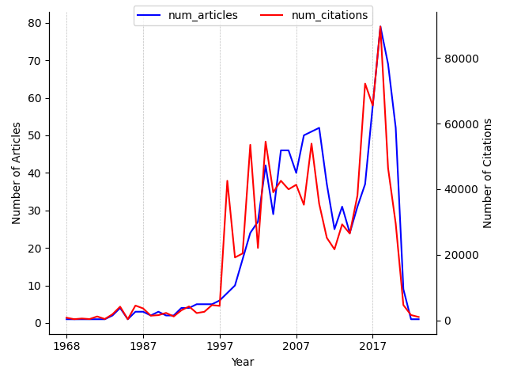

---
hide:
 - navigation
---

### 1. Search query

*(graph networks) | (physics constrain) | (learned simulator) | (learned simulation)*

### 2. Physics-informed GNNs articles and citations over time

### 3. Most cited articles on Physics-informed GNNs

| Title | PublicationDate | #Citations | Journal/Conference | publicationVenue |
| --- | --- | --- | --- | --- |
| [Gradient-based learning applied to document recognition](https://www.semanticscholar.org/paper/162d958ff885f1462aeda91cd72582323fd6a1f4) | None | 46003 | {'name': 'Proc. IEEE', 'pages': '2278-2324', 'volume': '86'} | {'id': '6faaccca-1cc4-45a9-aeb6-96a4901d2606', 'name': 'Proceedings of the IEEE', 'type': 'journal', 'alternate\_names': ['Proc IEEE'], 'issn': '0018-9219', 'alternate\_issns': ['1558-2256'], 'url': 'http://www.ieee.org/portal/pages/pubs/proceedings/', 'alternate\_urls': ['http://www.ieee.org/products/onlinepubs/pub/about\_conference.html', 'https://ieeexplore.ieee.org/servlet/opac?punumber=5', 'http://proceedingsoftheieee.ieee.org/']} |
| [Collective dynamics of ‘small-world’ networks](https://www.semanticscholar.org/paper/d61031326150ba23f90e6587c13d99188209250e) | 1998-06-04 | 38484 | {'name': 'Nature', 'pages': '440-442', 'volume': '393'} | {'id': '6c24a0a0-b07d-4d7b-a19b-fd09a3ed453a', 'name': 'Nature', 'type': 'journal', 'issn': '0028-0836', 'url': 'https://www.nature.com/', 'alternate\_urls': ['http://www.nature.com/nature/', 'https://www.nature.com/nature/', 'http://www.nature.com/nature/archive/index.html']} |
| [Semi-Supervised Classification with Graph Convolutional Networks](https://www.semanticscholar.org/paper/36eff562f65125511b5dfab68ce7f7a943c27478) | 2016-09-09 | 22114 | {'name': 'ArXiv', 'volume': 'abs/1609.02907'} | {'id': '939c6e1d-0d17-4d6e-8a82-66d960df0e40', 'name': 'International Conference on Learning Representations', 'type': 'conference', 'alternate\_names': ['Int Conf Learn Represent', 'ICLR'], 'url': 'https://iclr.cc/'} |
| [Statistical mechanics of complex networks](https://www.semanticscholar.org/paper/dce8146987557735a19771aefa1f027211a2c275) | 2001-06-06 | 18824 | {'name': 'ArXiv', 'volume': 'cond-mat/0106096'} | {'id': '1901e811-ee72-4b20-8f7e-de08cd395a10', 'name': 'arXiv.org', 'alternate\_names': ['ArXiv'], 'issn': '2331-8422', 'url': 'https://arxiv.org'} |
| [The Structure and Function of Complex Networks](https://www.semanticscholar.org/paper/e6c4925fb114d13a8568f88957c167c928f0c9f1) | 2003-03-25 | 16785 | {'name': 'SIAM Rev.', 'pages': '167-256', 'volume': '45'} | {'id': '8f59dd66-e4cd-4341-8ea9-9a03d965a009', 'name': 'SIAM Review', 'type': 'journal', 'alternate\_names': ['SIAM Rev', 'Siam Rev', 'Siam Review'], 'issn': '0036-1445', 'url': 'https://www.jstor.org/journal/siamreview', 'alternate\_urls': ['http://www.jstor.org/journals/00361445.html', 'https://epubs.siam.org/journal/siread', 'http://www.siam.org/journals/sirev.php']} |
| [TensorFlow: A system for large-scale machine learning](https://www.semanticscholar.org/paper/4954fa180728932959997a4768411ff9136aac81) | 2016-05-27 | 16703 | {'pages': '265-283'} | {'id': '86c43745-31d9-4c1a-b33f-ce3aa0042dbb', 'name': 'USENIX Symposium on Operating Systems Design and Implementation', 'type': 'conference', 'alternate\_names': ['Oper Syst Des Implement', 'Operating Systems Design and Implementation', 'OSDI', 'USENIX Symp Oper Syst Des Implement']} |
| [Community structure in social and biological networks](https://www.semanticscholar.org/paper/2a005868b79511cf8c924cd5990e2497527a0527) | 2001-12-07 | 14280 | {'name': 'Proceedings of the National Academy of Sciences of the United States of America', 'pages': '7821 - 7826', 'volume': '99'} | {'id': 'bb95bf2e-8383-4748-bf9d-d6906d091085', 'name': 'Proceedings of the National Academy of Sciences of the United States of America', 'type': 'journal', 'alternate\_names': ['PNAS', 'PNAS online', 'Proceedings of the National Academy of Sciences of the United States of America.', 'Proc National Acad Sci', 'Proceedings of the National Academy of Sciences', 'Proc National Acad Sci u s Am'], 'issn': '0027-8424', 'alternate\_issns': ['1091-6490'], 'url': 'https://www.jstor.org/journal/procnatiacadscie', 'alternate\_urls': ['http://www.pnas.org/', 'https://www.pnas.org/', 'http://www.jstor.org/journals/00278424.html', 'www.pnas.org/']} |
| [Graph Attention Networks](https://www.semanticscholar.org/paper/33998aff64ce51df8dee45989cdca4b6b1329ec4) | 2017-10-30 | 13972 | {'name': 'ArXiv', 'volume': 'abs/1710.10903'} | {'id': '939c6e1d-0d17-4d6e-8a82-66d960df0e40', 'name': 'International Conference on Learning Representations', 'type': 'conference', 'alternate\_names': ['Int Conf Learn Represent', 'ICLR'], 'url': 'https://iclr.cc/'} |
| [PRISMA Extension for Scoping Reviews (PRISMA-ScR): Checklist and Explanation](https://www.semanticscholar.org/paper/450106c6c960424b365249f2a301ce0abe24e346) | 2018-10-02 | 12792 | {'name': 'Annals of Internal Medicine', 'pages': '467-473', 'volume': '169'} | {'id': '643b0c17-99ac-463b-81c4-df44ad66e34d', 'name': 'Annals of Internal Medicine', 'type': 'journal', 'alternate\_names': ['Ann Intern Med'], 'issn': '0003-4819', 'url': 'http://www.acponline.org/journals/annals/annaltoc.htm', 'alternate\_urls': ['http://www.annals.org/']} |
| [Consensus problems in networks of agents with switching topology and time-delays](https://www.semanticscholar.org/paper/9839ed2281ba4b589bf88c7e4acc48c9fa6fb933) | 2004-09-13 | 11249 | {'name': 'IEEE Transactions on Automatic Control', 'pages': '1520-1533', 'volume': '49'} | {'id': '1283a59c-0d1f-48c3-81d7-02172f597e70', 'name': 'IEEE Transactions on Automatic Control', 'type': 'journal', 'alternate\_names': ['IEEE Trans Autom Control'], 'issn': '0018-9286', 'url': 'http://ieeexplore.ieee.org/servlet/opac?punumber=9'} |

### 4. Latest articles on Physics-informed GNNs

| Title | PublicationDate | #Citations | Journal/Conference | publicationVenue |
| --- | --- | --- | --- | --- |
| [Hierarchical spatio-temporal graph convolutional neural networks for traffic data imputation](https://www.semanticscholar.org/paper/04744b6893487a608e3726fb4542e2a7f9e81a5b) | 2024-06-01 | 0 | {'name': 'Information Fusion'} | {'id': '06afdd0b-0d85-413f-af8a-c3045c12c561', 'name': 'Information Fusion', 'type': 'journal', 'alternate\_names': ['Inf Fusion'], 'issn': '1566-2535', 'url': 'https://www.journals.elsevier.com/information-fusion', 'alternate\_urls': ['http://www.sciencedirect.com/science/journal/15662535']} |
| [Reagent dosage inference based on graph convolutional memory perception network for zinc roughing flotation](https://www.semanticscholar.org/paper/ba23319a62da63ec3b664f6452bb7a9aee8a46dc) | 2024-05-01 | 0 | {'name': 'Control Engineering Practice'} | {'id': 'af74e393-8f45-41cd-915b-734494cb48f2', 'name': 'Control Engineering Practice', 'type': 'journal', 'alternate\_names': ['Control Eng Pract'], 'issn': '0967-0661', 'url': 'http://www.elsevier.com/wps/find/journaldescription.cws\_home/123/description#description', 'alternate\_urls': ['http://www.sciencedirect.com/science/journal/09670661']} |
| [MACNS: A generic graph neural network integrated deep reinforcement learning based multi-agent collaborative navigation system for dynamic trajectory planning](https://www.semanticscholar.org/paper/a1a503c7c23502bebe94eb042b0ce9f8bdbb6504) | 2024-05-01 | 0 | {'name': 'Inf. Fusion', 'pages': '102250', 'volume': '105'} | {'id': '06afdd0b-0d85-413f-af8a-c3045c12c561', 'name': 'Information Fusion', 'type': 'journal', 'alternate\_names': ['Inf Fusion'], 'issn': '1566-2535', 'url': 'https://www.journals.elsevier.com/information-fusion', 'alternate\_urls': ['http://www.sciencedirect.com/science/journal/15662535']} |
| [DawnGNN: Documentation augmented windows malware detection using graph neural network](https://www.semanticscholar.org/paper/45cb2614652147789e18f1bc15d665977d2d1ee9) | 2024-05-01 | 0 | {'name': 'Computers & Security'} | None |
| [Multi-level Graph Memory Network Cluster Convolutional Recurrent Network for traffic forecasting](https://www.semanticscholar.org/paper/357677ec8b2223f049c45c7330633a5b85c2bc95) | 2024-05-01 | 0 | {'name': 'Inf. Fusion', 'pages': '102214', 'volume': '105'} | {'id': '06afdd0b-0d85-413f-af8a-c3045c12c561', 'name': 'Information Fusion', 'type': 'journal', 'alternate\_names': ['Inf Fusion'], 'issn': '1566-2535', 'url': 'https://www.journals.elsevier.com/information-fusion', 'alternate\_urls': ['http://www.sciencedirect.com/science/journal/15662535']} |
| [FairCare: Adversarial training of a heterogeneous graph neural network with attention mechanism to learn fair representations of electronic health records](https://www.semanticscholar.org/paper/3383c82d39b88e5349d345e32e879806bd72d435) | 2024-05-01 | 0 | {'name': 'Information Processing & Management'} | None |
| [Multi-criteria group decision making based on graph neural networks in Pythagorean fuzzy environment](https://www.semanticscholar.org/paper/13a50769f110029fcb3390956789aec236071c53) | 2024-05-01 | 1 | {'name': 'Expert Systems with Applications'} | {'id': '987139ae-a65d-49bb-aaf6-fb764dc40b19', 'name': 'Expert systems with applications', 'type': 'journal', 'alternate\_names': ['Expert syst appl', 'Expert Systems With Applications', 'Expert Syst Appl'], 'issn': '0957-4174', 'url': 'https://www.journals.elsevier.com/expert-systems-with-applications/', 'alternate\_urls': ['https://www.sciencedirect.com/journal/expert-systems-with-applications', 'http://www.sciencedirect.com/science/journal/09574174']} |
| [POI recommendation for random groups based on cooperative graph neural networks](https://www.semanticscholar.org/paper/0cfd9a1774cf41ff07e957bbc25d14596d529c4f) | 2024-05-01 | 0 | {'name': 'Information Processing & Management'} | None |
| [Attention based multi-task interpretable graph convolutional network for Alzheimer’s disease analysis](https://www.semanticscholar.org/paper/fc5ee86473fd698e3f4405b51bdfe0575304a30d) | 2024-04-01 | 0 | {'name': 'Pattern Recognition Letters'} | {'id': 'f35e3e87-9df4-497b-aa0d-bb8584197290', 'name': 'Pattern Recognition Letters', 'type': 'journal', 'alternate\_names': ['Pattern Recognit Lett'], 'issn': '0167-8655', 'url': 'https://www.journals.elsevier.com/pattern-recognition-letters/', 'alternate\_urls': ['http://www.journals.elsevier.com/pattern-recognition-letters/', 'http://www.sciencedirect.com/science/journal/01678655']} |
| [A coarse-to-fine adaptive spatial–temporal graph convolution network with residuals for motor imagery decoding from the same limb](https://www.semanticscholar.org/paper/f56be81f12e0c0bdf632d5feeaf028dfb791223a) | 2024-04-01 | 0 | {'name': 'Biomedical Signal Processing and Control'} | {'id': '1bac31b4-014a-4981-ae41-af2a40acc162', 'name': 'Biomedical Signal Processing and Control', 'type': 'journal', 'alternate\_names': ['Biomed Signal Process Control'], 'issn': '1746-8094', 'url': 'https://www.journals.elsevier.com/biomedical-signal-processing-and-control', 'alternate\_urls': ['http://www.sciencedirect.com/science/journal/17468094']} |

