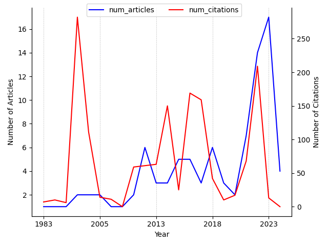

---
hide:
 - navigation
---

### 1. Search query

*((symbolic regression) + dynamics)*

### 2. Symbolic regression articles and citations over time

### 3. Most cited articles on Symbolic regression

| Title | PublicationDate | #Citations | Journal/Conference | publicationVenue |
| --- | --- | --- | --- | --- |
| [Symbolic Dynamic Programming for First-Order MDPs](https://www.semanticscholar.org/paper/9d59f87b881017e6ef0198636a77ad04b7ebea7a) | 2001-08-04 | 277 | {'pages': '690-700'} | {'id': '67f7f831-711a-43c8-8785-1e09005359b5', 'name': 'International Joint Conference on Artificial Intelligence', 'type': 'conference', 'alternate\_names': ['Int Jt Conf Artif Intell', 'IJCAI'], 'url': 'http://www.ijcai.org/'} |
| [On Neural Differential Equations](https://www.semanticscholar.org/paper/1f7ba0832203ab808fc8d6706836c591754b79da) | 2022-02-04 | 124 | {'name': 'ArXiv', 'volume': 'abs/2202.02435'} | {'id': '1901e811-ee72-4b20-8f7e-de08cd395a10', 'name': 'arXiv.org', 'alternate\_names': ['ArXiv'], 'issn': '2331-8422', 'url': 'https://arxiv.org'} |
| [A Survey And Analysis Of Diversity Measures In Genetic Programming](https://www.semanticscholar.org/paper/a164d4e754c8ef81b9e56a3aefcfbe92a06af9b2) | 2002-07-09 | 104 | {'pages': '716-723'} | {'id': 'd732841e-83f9-49ec-95ca-389e5568634b', 'name': 'Annual Conference on Genetic and Evolutionary Computation', 'type': 'conference', 'alternate\_names': ['GECCO', 'Annu Conf Genet Evol Comput', 'Genet Evol Comput Conf', 'Genetic and Evolutionary Computation Conference'], 'url': 'http://www.sigevo.org/'} |
| [Prediction of dynamical systems by symbolic regression.](https://www.semanticscholar.org/paper/99c7d71317f3532cdcf83f072d644c236610221d) | 2016-02-15 | 91 | {'name': 'Physical review. E', 'pages': '\n 012214\n ', 'volume': '94 1-1'} | {'id': '19842b7b-a4d1-4f9a-9714-87d878cf6e73', 'name': 'Physical Review E', 'type': 'journal', 'alternate\_names': ['Phys rev E', 'Physical review. E', 'Phys Rev E'], 'issn': '1539-3755', 'alternate\_issns': ['1550-2376', '2470-0045'], 'url': 'https://journals.aps.org/pre/', 'alternate\_urls': ['http://pre.aps.org/', 'http://journals.aps.org/pre/']} |
| [Take Their Word for It: The Symbolic Role of Linguistic Style Matches in User Communities](https://www.semanticscholar.org/paper/7f701c60d0b73af3ad2b70c6303e0cac18fc47a4) | 2014-12-01 | 69 | {'name': 'MIS Q.', 'pages': '1201-1217', 'volume': '38'} | None |
| [Data Based Prediction of Blood Glucose Concentrations Using Evolutionary Methods](https://www.semanticscholar.org/paper/8c44933472c5f6e871197be88ba9477ac577ebc6) | 2017-08-08 | 67 | {'name': 'Journal of Medical Systems', 'pages': '1-20', 'volume': '41'} | {'id': '79c59592-820f-4ed1-87df-db795b4326be', 'name': 'Journal of medical systems', 'type': 'journal', 'alternate\_names': ['J Med Syst', 'Journal of Medical Systems', 'J med syst'], 'issn': '0148-5598', 'url': 'https://link.springer.com/journal/10916'} |
| [Who Is Responsible for the Gender Gap? The Dynamics of Men’s and Women’s Democratic Macropartisanship, 1950–2012](https://www.semanticscholar.org/paper/ea19352c48d8e1f514ed04c87262c6e2f2069616) | 2017-07-03 | 61 | {'name': 'Political Research Quarterly', 'pages': '749 - 761', 'volume': '70'} | None |
| [On the closed form computation of the dynamic matrices and their differentiations](https://www.semanticscholar.org/paper/ef2824bb7e720bc6448d7e8e4496a49f9a5d2717) | 2013-11-01 | 55 | {'name': '2013 IEEE/RSJ International Conference on Intelligent Robots and Systems', 'pages': '2364-2359'} | None |
| [Automatic rule identification for agent-based crowd models through gene expression programming](https://www.semanticscholar.org/paper/6e4abe45f2981c8e0dc0cc2e2615f7b1bb1fcd68) | 2014-05-05 | 49 | {'pages': '1125-1132'} | {'id': '6c3a9833-5fac-49d3-b7e7-64910bd40b4e', 'name': 'Adaptive Agents and Multi-Agent Systems', 'type': 'conference', 'alternate\_names': ['Adapt Agent Multi-agent Syst', 'International Joint Conference on Autonomous Agents & Multiagent Systems', 'Adapt Agent Multi-agents Syst', 'AAMAS', 'Adaptive Agents and Multi-Agents Systems', 'Int Jt Conf Auton Agent Multiagent Syst'], 'url': 'http://www.ifaamas.org/'} |
| [Rediscovering orbital mechanics with machine learning](https://www.semanticscholar.org/paper/0d774d92c9c03648a213e5dc416065b0b72d894e) | 2022-02-04 | 46 | {'name': 'Machine Learning: Science and Technology', 'volume': '4'} | None |

### 4. Latest articles on Symbolic regression

| Title | PublicationDate | #Citations | Journal/Conference | publicationVenue |
| --- | --- | --- | --- | --- |
| [Shared professional logics amongst managers and bureaucrats in Brazilian social security: a street-level mixed-methods study](https://www.semanticscholar.org/paper/3c2bc03831c40da210da5f02806386981973ba48) | 2024-02-20 | 0 | {'name': 'International Journal of Public Sector Management'} | {'id': '39bcb8aa-e2fe-4135-bdce-6794f52e3e76', 'name': 'International Journal of Public Sector Management', 'type': 'journal', 'alternate\_names': ['Int J Public Sect Manag'], 'issn': '0951-3558', 'url': 'https://www.emerald.com/insight/publication/issn/0951-3558', 'alternate\_urls': ['http://www.emeraldinsight.com/0951-3558.htm']} |
| [Excitation Trajectory Optimization for Dynamic Parameter Identification Using Virtual Constraints in Hands-on Robotic System](https://www.semanticscholar.org/paper/f5c21a0dd557e33b683cab99268d37b04cc912bd) | 2024-01-29 | 0 | {'name': 'ArXiv', 'volume': 'abs/2401.16566'} | {'id': '1901e811-ee72-4b20-8f7e-de08cd395a10', 'name': 'arXiv.org', 'alternate\_names': ['ArXiv'], 'issn': '2331-8422', 'url': 'https://arxiv.org'} |
| [Population Dynamics in Genetic Programming for Dynamic Symbolic Regression](https://www.semanticscholar.org/paper/0fa5509ee2975b72c8a47ba5f0a60b84774cfd80) | 2024-01-10 | 0 | {'name': 'Applied Sciences'} | {'id': '136edf8d-0f88-4c2c-830f-461c6a9b842e', 'name': 'Applied Sciences', 'type': 'journal', 'alternate\_names': ['Appl Sci'], 'issn': '2076-3417', 'url': 'http://www.e-helvetica.nb.admin.ch/directAccess?callnumber=bel-217814', 'alternate\_urls': ['http://www.mathem.pub.ro/apps/', 'https://www.mdpi.com/journal/applsci', 'http://nbn-resolving.de/urn/resolver.pl?urn=urn:nbn:ch:bel-217814']} |
| [Reassessing the transport properties of fluids: A symbolic regression approach.](https://www.semanticscholar.org/paper/7864dd40fc44eb8517ef0e87b7f9e965772ece9d) | 2024-01-01 | 0 | {'name': 'Physical review. E', 'pages': '\n 015105\n ', 'volume': '109 1-2'} | {'id': '19842b7b-a4d1-4f9a-9714-87d878cf6e73', 'name': 'Physical Review E', 'type': 'journal', 'alternate\_names': ['Phys rev E', 'Physical review. E', 'Phys Rev E'], 'issn': '1539-3755', 'alternate\_issns': ['1550-2376', '2470-0045'], 'url': 'https://journals.aps.org/pre/', 'alternate\_urls': ['http://pre.aps.org/', 'http://journals.aps.org/pre/']} |
| [(Invited) Electrochemical Interfaces in Energy Storage: Theory Meets Experiment](https://www.semanticscholar.org/paper/d97335e9ed5301ea056f8957faa5f5b7ef105fac) | 2023-12-22 | 0 | {'name': 'ECS Meeting Abstracts'} | {'id': '4718308a-312e-40e7-a6f2-5110d1359b6a', 'name': 'ECS Meeting Abstracts', 'alternate\_names': ['EC Meet Abstr'], 'issn': '1091-8213', 'url': 'http://ma.ecsdl.org/'} |
| [AI-Lorenz: A physics-data-driven framework for black-box and gray-box identification of chaotic systems with symbolic regression](https://www.semanticscholar.org/paper/f5cccd316e70bd2366e67260e1f691761bd512d3) | 2023-12-21 | 0 | {'name': 'ArXiv', 'volume': 'abs/2312.14237'} | {'id': '1901e811-ee72-4b20-8f7e-de08cd395a10', 'name': 'arXiv.org', 'alternate\_names': ['ArXiv'], 'issn': '2331-8422', 'url': 'https://arxiv.org'} |
| [Machine Learning-Based Approach to Wind Turbine Wake Prediction under Yawed Conditions](https://www.semanticscholar.org/paper/ef9533aa3205d0fc999fa12e703d43899f09191b) | 2023-11-04 | 2 | {'name': 'Journal of Marine Science and Engineering'} | {'id': 'fff3549c-df24-4aef-accb-a33ae442a828', 'name': 'Journal of Marine Science and Engineering', 'type': 'journal', 'alternate\_names': ['J Mar Sci Eng'], 'issn': '2077-1312', 'url': 'https://www.mdpi.com/journal/jmse'} |
| [Boolformer: Symbolic Regression of Logic Functions with Transformers](https://www.semanticscholar.org/paper/ca6fb9d804aa339c0ba686545ddb78d4c5e45e02) | 2023-09-21 | 1 | {'name': 'ArXiv', 'volume': 'abs/2309.12207'} | {'id': '1901e811-ee72-4b20-8f7e-de08cd395a10', 'name': 'arXiv.org', 'alternate\_names': ['ArXiv'], 'issn': '2331-8422', 'url': 'https://arxiv.org'} |
| [GPSINDy: Data-Driven Discovery of Equations of Motion](https://www.semanticscholar.org/paper/7aa4950045a9a790857d169f999a479da147a3f3) | 2023-09-20 | 0 | {'name': 'ArXiv', 'volume': 'abs/2309.11076'} | {'id': '1901e811-ee72-4b20-8f7e-de08cd395a10', 'name': 'arXiv.org', 'alternate\_names': ['ArXiv'], 'issn': '2331-8422', 'url': 'https://arxiv.org'} |
| [Symbolic regression via neural networks.](https://www.semanticscholar.org/paper/eddffa1f2cf18c7ca4edbdaf01fd805f415aa4b8) | 2023-08-01 | 2 | {'name': 'Chaos', 'volume': '33 8'} | {'id': '30c0ded7-c8b4-473c-bbc0-f237234ac1a6', 'name': 'Chaos', 'type': 'journal', 'issn': '1054-1500', 'url': 'http://chaos.aip.org/', 'alternate\_urls': ['https://aip.scitation.org/journal/cha']} |

